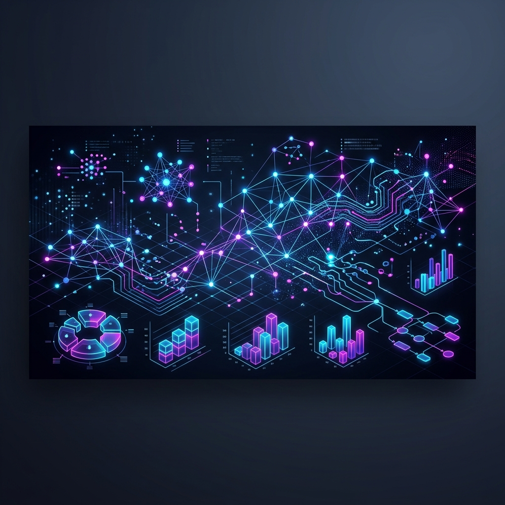
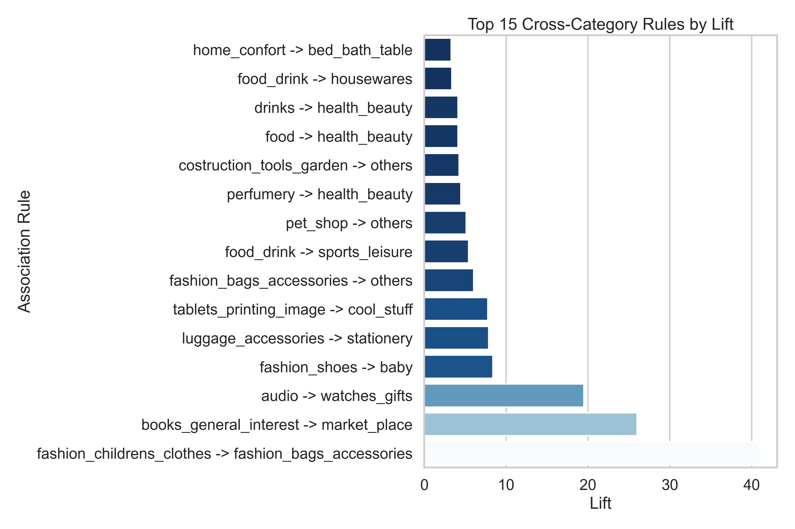
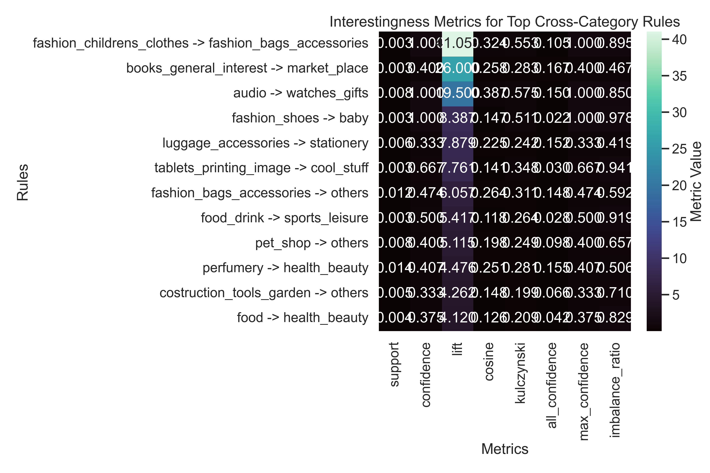
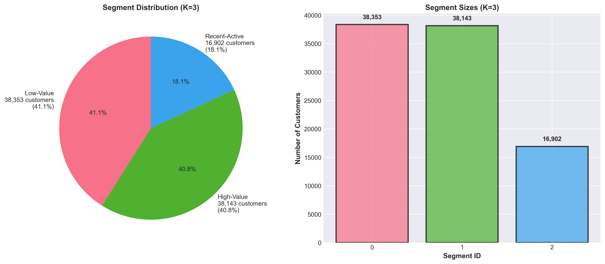
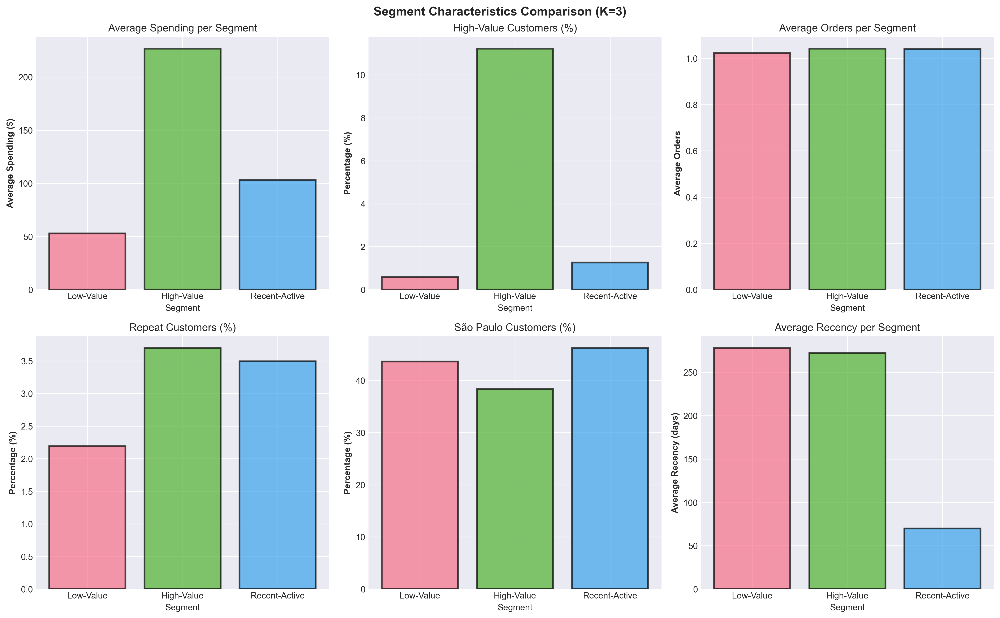
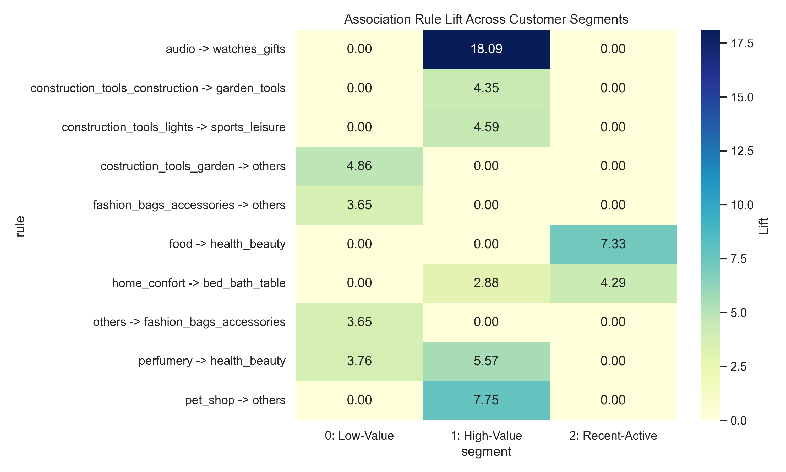
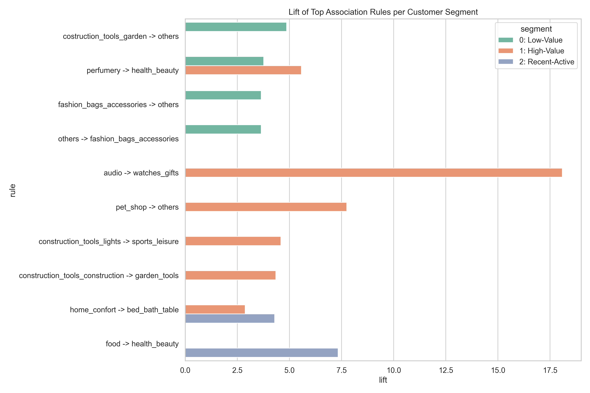

# Data Mining Project: Customer 360 — Olist E-Commerce Analysis

**Status:** Phase 1 ✅ | Phase 2 ✅ | Phase 3 ✅ | Phase 4 ✅  
**Last Updated:** April 26, 2026  
**Team:** Saad Nasir (23L-2625) · Ibrahim Moeed (23L-2602) · Abdullah Azmat (23L-2611)

---

## Overview

Full data mining pipeline on the **Olist Brazilian E-Commerce dataset** (100K+ orders, 2016–2018) built to answer:

> **"How do product associations differ across customer segments?"**

Two complementary analyses combined into a **Customer 360** view:
- **Phase 2 — Association Rule Mining:** *What products go together?*
- **Phase 3 — Customer Segmentation:** *Who are our customers?*
- **Phase 4 — Integration:** *How do associations differ per segment?*

---

## Project Structure

```
DM_project/
├── README.md                    This file
├── RUN_PROJECT_COMPLETE.py      Master summary & final execution validator
├── VALIDATE_ALL_PHASES.py       Comprehensive project integrity checker
│
├── phase1/                      Phase 1 scripts
│   ├── preprocessing.py
│   ├── cleaning.py
│   ├── feature_engineering.py
│   ├── feature_scaling.py
│   ├── feature_scaling_visualizations.py
│   ├── eda_report.py
│   └── validate_phase1.py
│
├── phase2/
│   └── new_implementation/
│       ├── scripts/
│       │   ├── arm_cross_category.py
│       │   ├── arm_intra_category.py
│       │   └── threshold_exploration.py
│       └── outputs/
│           ├── cross_category/
│           │   ├── cross_category_rules.csv     25 rules
│           │   ├── cross_category_summary.txt
│           │   ├── visualizations/              4 charts (PNG)
│           │   └── exports/                     3 CSV exports
│           └── intra_category/
│               ├── intra_category_rules.csv     2 rules
│               └── visualizations/
│
├── phase3/
│   ├── phase3_clustering.py
│   ├── create_phase3_visualizations.py
│   └── visualizations/                          6 charts (PNG)
│
├── phase4/
│   ├── segment_arm.py               Segmented rule mining logic
│   ├── compare_segments.py          Comparative visualization script
│   ├── PHASE_4_INSIGHTS.md          Strategic persona-based report
│   └── outputs/
│       ├── segment_0_rules.csv
│       ├── segment_1_rules.csv
│       ├── segment_2_rules.csv
│       └── visualizations/          Comparative heatmaps & bar charts
│
├── data/                        Raw CSVs + all processed outputs
│   ├── master_cleaned.csv
│   ├── master_df.csv
│   ├── customer_features_full.csv
│   ├── customer_features_kprototypes.csv
│   ├── customer_segments_k3.csv
│   ├── clustering_metrics_k3.json
│   └── segment_profiles_k3.csv
│
├── docs/                        Project proposal and documentation
├── DO_NOT_PUSH/                 Presentation reference files (not for repo)
└── venv/                        Python virtual environment
```

---

## What We Did

### Phase 1 — Data Preprocessing & EDA
- Loaded 8 raw Olist CSVs into PostgreSQL
- Cleaned data: nulls, duplicates, invalid prices, outliers
- Engineered RFM features: Recency, Frequency, Monetary + behavioral flags
- Scaled features: log transformation + RobustScaler
- Output: `master_cleaned.csv` (100,196 rows) + feature files

### Phase 2 — Association Rule Mining
- Conducted two distinct analyses: **Cross-Category** and **Intra-Category** rule mining
- **Cross-Category Analysis**: Filtered to 780 multi-category orders (0.8% of total) to find associations between different product categories
- **Intra-Category Analysis**: Analyzed orders to find product associations within the same category
- Applied **Apriori** and **FP-Growth** independently
- Both algorithms produced **identical results** (100% convergence)
- Output: `cross_category_rules.csv` (25 rules), `intra_category_rules.csv` (2 rules), along with visualizations and exports

#### **Phase 2 Visual Insights**

*Figure 1: Top 15 Association Rules ranked by Lift.*


*Figure 2: Correlation heatmap between Support, Confidence, and Lift.*

### Phase 3 — Customer Segmentation
- Built RFM + geographic (state) feature matrix for 93,398 customers
- Applied **K-Prototypes** (handles mixed numerical + categorical data)
- Trained on 15% stratified sample, predicted on full dataset
- Optimal K=3 determined by Elbow + Silhouette + Davies-Bouldin + Calinski-Harabasz consensus
- Output: segment assignments, metrics JSON, profile CSV, 6 visualizations

#### **Phase 3 Visual Insights**

*Figure 3: Population distribution across the three identified segments.*


*Figure 4: Comparative analysis of spending and recency across clusters.*

### Phase 4 — Integration & Strategic Insights
- Bridged Segment Labels with Association Rules using **Segmented ARM**
- Applied FP-Growth independently to each cluster with **Dynamic Support Thresholds**
- Identified three distinct **"Shopping Personalities"** with unique cross-sell logic
- Developed a comparative lift analysis to validate segment-specific behaviors
- Output: Segmented rules, comparative heatmaps, and a strategic persona report

#### **Phase 4 Visual Insights**

*Figure 5: Heatmap showing how Association Rule Lift differs significantly across Segments.*


*Figure 6: Side-by-side comparison of rule strength per customer persona.*

---

## Key Results

### Phase 2 — Association Rules

**Cross-Category Analysis**
| Metric | Value |
|--------|-------|
| Multi-category orders analyzed | 780 (0.8% of total) |
| Association rules found | 25 |
| Algorithm agreement | 100% (Apriori = FP-Growth) |
| Max lift | **41.05x** (children's clothing → bags) |
| Average lift | **6.84x** |
| Industry benchmark | 1.5–3x |

**Intra-Category Analysis**
| Metric | Value |
|--------|-------|
| Association rules found | 2 |
| Algorithm agreement | 100% (Apriori = FP-Growth) |

**Top 3 Cross-Category Rules:**

| Antecedent | Consequent | Lift | Confidence |
|------------|-----------|------|-----------|
| Children's Clothing | Bags & Accessories | 41.05x | 100% |
| General Books | Marketplace | 26.00x | 40% |
| Audio Equipment | Watches & Gifts | 19.50x | 100% |

### Phase 3 — Customer Segments

| Segment | Size | Avg Spend | Recency | Repeat % | Profile |
|---------|------|-----------|---------|----------|---------|
| 0 | 38,353 (41%) | $52.89 | 278 days | 2.2% | Low-value, Churned |
| 1 | 38,143 (41%) | $226.57 | 272 days | 3.7% | High-value, Inactive |
| 2 | 16,902 (18%) | $102.90 | 70 days | 3.5% | Recent & Active |

| Clustering Metric | Value | Quality |
|------------------|-------|---------|
| Silhouette Score | 0.38 | Good |
| Davies-Bouldin Index | 0.97 | Good |
| Calinski-Harabasz | 9,364 | — |

### Phase 4 — The Three Shopping Personalities

| Persona | Data Pattern | Shopping Logic | Strategic Action |
|:--- | :--- | :--- | :--- |
| **The Impulse Shopper** (Seg 0) | Perfumery → Beauty | Vanity / Treat-Yourself | "Complete the Look" cross-sells |
| **The Project Planner** (Seg 1) | Construction → Garden | Lifestyle / Investment | Long-cycle re-engagement |
| **The Household Manager** (Seg 2) | Food → Bed/Bath/Table | Recurring / Domestic | Subscription & Loyalty models |

**Key Integration Finding:** Segment 1 (High-Value) shows a **18x Lift** for Audio → Watches, while Segment 0 (Low-Value) shows a **3.7x Lift** for Perfumery → Health/Beauty, proving that high-value customers shop with significantly stronger category-intent than low-value ones.

---

## How to Run

```powershell
# Activate virtual environment
.\venv\Scripts\Activate.ps1

# View full project summary & validate all outputs (Phase 1 to 4)
python RUN_PROJECT_COMPLETE.py

# Run detailed technical integrity check
python VALIDATE_ALL_PHASES.py
```

---

## Technologies

| Library | Purpose |
|---------|---------|
| pandas, numpy | Data processing |
| sqlalchemy, psycopg2 | PostgreSQL integration |
| mlxtend | Apriori & FP-Growth (Phase 2) |
| kmodes | K-Prototypes clustering (Phase 3) |
| scikit-learn | Metrics & preprocessing |
| matplotlib, seaborn | Visualizations |

**Python 3.12 · PostgreSQL 17.6**
